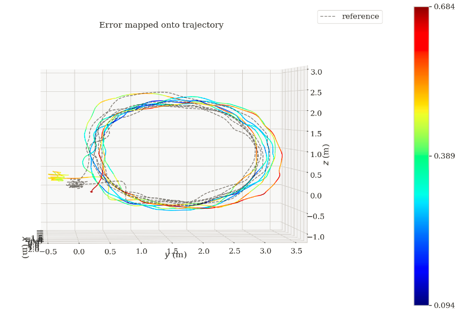
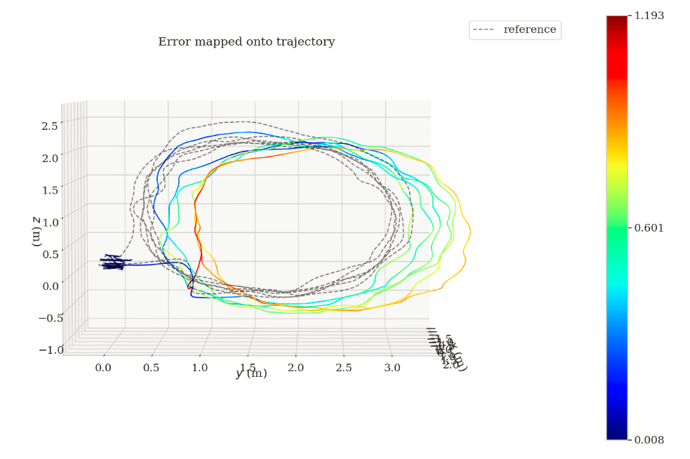

# VCU_RVI_Benchmark
All data sequences are accessible at 
https://vcu-rvi-dataset.github.io/2020/08/14/Dataset-Download/

Implementations of VIO methods to use the benchmark with examples

## 1. Demo
A preview for the data sequences in the benchmark is shown below

<a href="https://youtu.be/sgyO-Rcb7-8" target="_blank"></a>

## 2. Open source of VIO methods to test the data sequences
+ VINS-Fusion: https://github.com/rising-turtle/VINS-Fusion
+ VINS-RGBD: https://github.com/rising-turtle/VINS-RGBD 
+ VINS-Mono: https://github.com/rising-turtle/VINS-Mono
+ Open_VINS: https://github.com/rising-turtle/open_vins

Topics:
+ depth topic: /cam0/depth
+ color topic: /cam0/color
+ imu topic: /imu

## 3. Evaluation 
Ground truths can be downloaded in the **tools** folder as well as files with helper functions.   
In the folder **tools**, *process_result.py* (or *process_result_old.py* for old scipy version) can be used to process the VINS' trajectory output, by calling 

```python
python process_result.py [trajectory_result].csv [data_sequence_name] 
```

```[trajectory_result].csv``` is the output of VINS-Mono/VINS-RGBD/DUI-VIO, some examples can be found in the folder **test_results** 
```[data_sequence_name]``` are the data sequence names defined in Table III and IV in the [paper](./tools/IROS20_0685_FI.pdf) 

e.g. ```python process_result.py lab_motion2.csv lab-motion2 ```

This ouputs a new trajectory file in the *TUM* format, with suffix *[trajectory_result]_tum.csv*.    
Next, use [evo](https://github.com/MichaelGrupp/evo) to evaluate the results compared to the ground truth 

e.g. ```evo_ape tum lab_motion2_gt.csv lab_motion2_tum.csv -a -p```



Or, we can use the following command to align to the ground truth with the first *N* frames:

e.g. ```evo_ape tum lab_motion2_gt.csv lab_motion2_tum.csv -a --n_to_align 100 -p```




